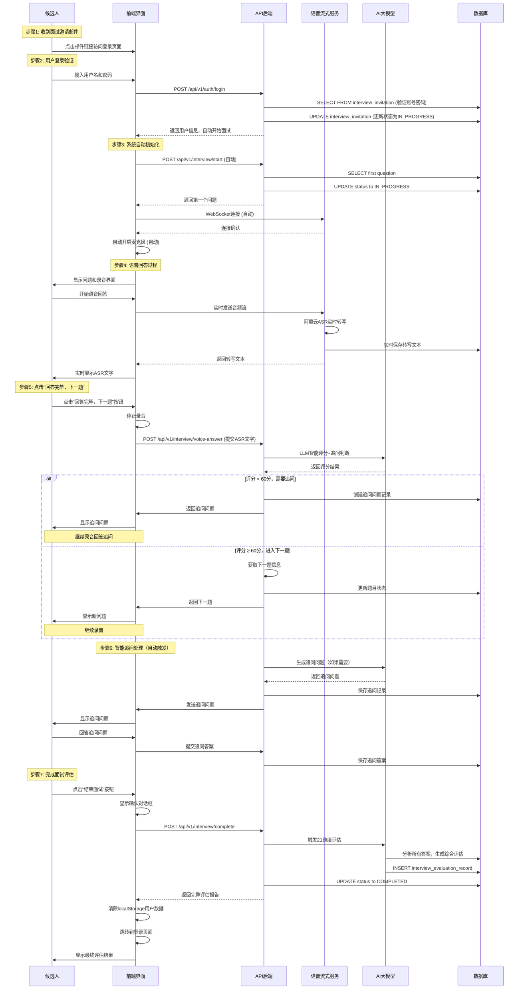

# VoiceBridge 智能语音面试系统 - 重构版文档
## 一、核心业务流程
### 步骤1：收到面试邀请邮件
#### 业务描述
候选人收到面试邀请邮件，点击邮件内链接启动面试流程，此步骤无后端逻辑和数据库操作。
#### 前端操作
- 点击邮件中的面试链接，跳转到系统登录页面。
#### API调用
无
#### 后端API调用参数
无
#### 返回内容
无
#### 数据库读写
无

### 步骤2：用户登录验证
#### 业务描述
候选人输入账号密码完成身份验证，登录成功后系统自动触发面试流程，无需手动确认。
#### 前端操作
- 输入用户名和密码；
- 点击「登录」按钮提交表单；
- 页面显示加载状态；
- 登录成功后自动跳转至面试页面，触发面试初始化流程。
#### API调用
```javascript
// POST /api/v1/auth/login
fetch('/api/v1/auth/login', {
  method: 'POST',
  headers: {
    'Content-Type': 'application/json'
  },
  body: JSON.stringify({
    username: 'candidate_username',
    password: 'candidate_password'
  })
});
```
#### 后端API调用参数
```json
{
  "username": "candidate_username",
  "password": "candidate_password"
}
```
#### 返回内容
```json
{
  "success": true,
  "message": "登录成功",
  "user": {
    "id": "invitation_id",
    "username": "candidate_username",
    "full_name": "候选人姓名",
    "user_type": "candidate"
  },
  "invitation_data": {
    "invitation_id": "invitation_id",
    "candidate_name": "候选人姓名",
    "requester": "招聘公司",
    "position": "应聘职位",
    "department": "应聘部门",
    "basic_info_duration": 300,
    "professional_duration": 600
  }
}
```
#### 数据库读写
**读取操作**：
```sql
-- 直接从interview_invitation表验证候选人账号密码（不使用独立的users表）
SELECT invitation_id, candidate_name, position, department,
       basic_info_duration, basic_info_focus, professional_duration, professional_focus,
       interview_status, candidate_username, candidate_password,
       created_time, updated_time, requester
FROM interview_invitation
WHERE candidate_username = ?
ORDER BY created_time DESC
LIMIT 1;
```
**写入操作**：
```sql
-- 如果状态为CONFIRMED，更新为IN_PROGRESS
UPDATE interview_invitation
SET interview_status = 'IN_PROGRESS',
    interview_actual_start_time = CURRENT_TIMESTAMP,
    updated_time = CURRENT_TIMESTAMP
WHERE invitation_id = ? AND interview_status = 'CONFIRMED';
```

### 步骤3：自动初始化面试
#### 业务描述
系统自动创建面试会话、获取关联问题列表、初始化WebSocket语音流式服务，为面试做前置准备。
#### 前端操作
- 自动调用API创建面试会话；
- 自动获取基础题和专业题列表并合并排序；
- 展示面试官介绍和题目总数信息；
- 初始化WebSocket连接至语音流式服务。
#### API调用
无（前端自动触发后端初始化逻辑，无显式API调用）
#### 后端API调用参数
无
#### 返回内容
无
#### 数据库读写
**写入操作**：
```sql
-- 创建面试会话记录
INSERT INTO interview_session (
    session_id,
    invitation_id,
    session_status,
    total_questions,
    current_question_index,
    created_at
) VALUES (
    ?,
    ?,
    'CREATED',
    (SELECT COUNT(*) FROM interview_question WHERE invitation_id = ?),
    0,
    CURRENT_TIMESTAMP
);
```
**读取操作**：
```sql
-- 获取问题列表
SELECT iq.question_id, iq.question_type, iq.question_order,
       iqs.content as question_text
FROM interview_question iq
LEFT JOIN interview_questions iqs ON iq.atomic_question_id = iqs.id
WHERE iq.invitation_id = ?
ORDER BY iq.question_order ASC;
```

### 步骤4：自动开始面试
#### 业务描述
系统加载第一个面试问题，自动建立WebSocket语音连接并启动录音，进入正式面试环节。
#### 前端操作
- 展示AI面试官介绍和题目总数；
- 自动调用API获取第一个问题；
- 自动建立WebSocket连接至语音流式服务；
- 自动启动录音，页面显示「录音中」状态；
- 实时展示ASR转写文字。
#### API调用
```javascript
// POST /api/v1/interview/start
fetch('/api/v1/interview/start', {
  method: 'POST',
  headers: {
    'Content-Type': 'application/json'
  },
  body: JSON.stringify({
    invitation_id: 'invitation_id'
  })
});

// WebSocket连接建立
const ws = new WebSocket('ws://localhost:8765/ws/asr');
```
#### 后端API调用参数
```json
{
  "invitation_id": "uuid"
}
```
#### 返回内容
```json
{
  "success": true,
  "message": "面试开始成功",
  "data": {
    "session_id": "session_uuid",
    "invitation_id": "invitation_uuid",
    "status": "IN_PROGRESS",
    "current_question": {
      "question_id": "question_uuid",
      "question_text": "请描述一次你与同事协作解决问题的经历。",
      "order": 1,
      "evaluation_points": [...]
    },
    "total_questions": 15,
    "current_index": 1,
    "basic_questions": ["q1", "q2", ...],
    "professional_questions": ["q6", "q7", ...]
  }
}
```
#### 数据库读写
**读取操作**：
```sql
-- 获取第一个问题
SELECT
    iq.question_id,
    iq.atomic_question_id,
    iq.question_type,
    iq.question_order,
    iq.estimated_time,
    iqs.content as question_text
FROM interview_question iq
LEFT JOIN interview_questions iqs ON iq.atomic_question_id = iqs.id
WHERE iq.invitation_id = ?
ORDER BY iq.question_order ASC
LIMIT 1;
```
**写入操作**：
```sql
-- 更新面试状态
UPDATE interview_invitation
SET interview_status = 'IN_PROGRESS',
    updated_time = CURRENT_TIMESTAMP
WHERE invitation_id = ?;
```

### 步骤5：语音回答过程
#### 业务描述
候选人语音回答问题，系统通过WebSocket实时传输音频流至阿里云ASR，完成实时语音转写并展示。
#### 前端操作
- 麦克风自动启动录音；
- WebSocket实时发送音频流至阿里云ASR；
- 页面中间区域实时展示转写文字；
- 展示录音波形动画。
#### API调用
```javascript
// WebSocket实时语音流
const ws = new WebSocket('ws://localhost:8765/ws/asr');

// 发送音频数据
ws.send(audioBlob);

// 接收转写结果
ws.onmessage = (event) => {
  const data = JSON.parse(event.data);
  if (data.type === 'transcription') {
    updateTranscript(data.result.text);
  }
};
```
#### 后端API调用参数
```json
{
  "session_id": "session_uuid",
  "invitation_id": "invitation_uuid",
  "user_id": "candidate_id"
}
```
#### 返回内容
```json
{
  "type": "transcription",
  "session_id": "session_uuid",
  "timestamp": 1234567890,
  "result": {
    "text": "转写文本内容",
    "confidence": 0.95,
    "is_final": false
  },
  "evaluation": {
    "score": 85,
    "reason": "回答较为完整",
    "need_follow_up": false
  }
}
```
#### 数据库读写
**写入操作**：
```sql
-- 实时保存ASR转写文本
INSERT INTO candidate_answers (
    answer_id,
    session_id,
    question_id,
    answer_text,
    create_time
) VALUES (
    gen_random_uuid(),
    ?,
    ?,
    ?,
    CURRENT_TIMESTAMP
) ON CONFLICT (session_id, question_id)
  DO UPDATE SET answer_text = EXCLUDED.answer_text,
                updated_time = CURRENT_TIMESTAMP;
```

### 步骤6：点击「回答完毕，下一题」
#### 业务描述
候选人完成当前问题回答，提交转写文本至后端，触发AI智能评分，系统判断是否需要生成追问问题。
#### 前端操作
- 点击「回答完毕，下一题」按钮；
- 停止当前录音（终止音频流采集，保持WebSocket连接）；
- 将ASR转写文字提交至后端API；
- 页面显示「正在发送给AI评分系统...」加载状态；
- 根据后端返回结果展示评分、追问问题或下一题。
#### API调用
```javascript
// POST /api/v1/interview/voice-answer
fetch('/api/v1/interview/voice-answer', {
  method: 'POST',
  headers: {
    'Content-Type': 'application/json'
  },
  body: JSON.stringify({
    session_id: 'session_uuid',
    question_id: 'question_uuid',
    answer_text: '转写后的文字内容'
  })
});
```
#### 后端API调用参数
```json
{
  "session_id": "session_uuid",
  "question_id": "question_uuid",
  "answer_text": "转写后的文字内容",
  "confidence": 0.95
}
```
#### 返回内容
```json
{
  "success": true,
  "message": "回答提交成功",
  "data": {
    "session_id": "session_uuid",
    "question_id": "question_uuid",
    "answer_id": "answer_uuid",
    "evaluation_result": {
      "score": 85,
      "grade": "良好",
      "reason": "回答较为完整",
      "need_follow_up": false,
      "follow_up_question": null
    },
    "star_followup": {
      "action": "next_question",
      "reasoning": "回答质量良好，继续下一题"
    },
    "next_question": {
      "question_id": "next_question_uuid",
      "question_text": "请描述你的职业规划",
      "order": 2
    },
    "is_completed": false
  }
}
```
#### 数据库读写
**写入操作**：
```sql
-- 保存完整回答和评分结果
INSERT INTO candidate_answers (
    answer_id, session_id, question_id, answer_text,
    evaluation_result, final_score, need_follow_up,
    follow_up_question, create_time
) VALUES (?, ?, ?, ?, ?, ?, ?, ?, CURRENT_TIMESTAMP);

-- 如果需要追问，创建追问记录
INSERT INTO candidate_answers (
    answer_id, session_id, question_id, is_follow_up,
    follow_up_question, parent_answer_id, create_time
) VALUES (?, ?, ?, TRUE, ?, ?, CURRENT_TIMESTAMP);
```

### 步骤7：智能追问处理
#### 业务描述
当单个问题评分低于60分（追问阈值）时，系统自动生成针对性追问问题，候选人完成追问回答后，合并原始答案与追问答案重新评分。
#### 前端操作
- 页面展示AI生成的追问问题；
- 继续启动录音和ASR实时转写；
- 合并展示原始答案和追问答案。
#### API调用
```javascript
// POST /api/v1/interview/follow-up
fetch('/api/v1/interview/follow-up', {
  method: 'POST',
  headers: {
    'Content-Type': 'application/json',
    'Authorization': 'Bearer {access_token}'
  },
  body: JSON.stringify({
    "session_id": "test_invitation_001",
    "question_id": "test_invitation_001_q1",
    "follow_up_question": "能否详细说明您在项目中遇到的具体技术挑战？",
    "evaluation_result": {
      "score": 45,
      "point_scores": [
        {"point": "问题理解", "score": 30, "reason": "未能准确理解问题"},
        {"point": "解决方案", "score": 40, "reason": "解决方案不完整"}
      ],
      "need_follow_up": true
    }
  })
});
```
#### 后端API调用参数
```json
{
  "session_id": "test_invitation_001",
  "question_id": "test_invitation_001_q1",
  "follow_up_question": "能否详细说明您在项目中遇到的具体技术挑战？",
  "evaluation_result": {
    "score": 45,
    "point_scores": [
      {"point": "问题理解", "score": 30, "reason": "未能准确理解问题"},
      {"point": "解决方案", "score": 40, "reason": "解决方案不完整"}
    ],
    "need_follow_up": true
  }
}
```
#### 返回内容
```json
{
  "success": true,
  "message": "追问已生成",
  "data": {
    "session_id": "test_invitation_001",
    "question_id": "test_invitation_001_q1",
    "follow_up_question": {
      "question_id": "follow_up_123",
      "question_text": "能否详细说明您在项目中遇到的具体技术挑战？",
      "is_follow_up": true,
      "estimated_duration": 120,
      "evaluation_points": [
        {"point": "技术挑战描述", "weight": 0.5},
        {"point": "解决方案详述", "weight": 0.5}
      ]
    },
    "follow_up_limit": 2,
    "follow_up_used": 1
  }
}
```
#### 数据库读写
**读取操作**：
```sql
-- 检查是否已达到追问次数限制
SELECT
    COUNT(*) as follow_up_count,
    MAX(follow_up_used) as max_follow_up_used
FROM candidate_answers
WHERE session_id = (
    SELECT session_id FROM interview_session
    WHERE invitation_id = 'test_invitation_001' AND question_id = 'test_invitation_001_q1'
)
AND question_id = 'test_invitation_001_q1';

-- 获取原始答案内容
SELECT answer_id, answer_text, evaluation_result
FROM candidate_answers
WHERE session_id = (
    SELECT session_id FROM interview_session
    WHERE invitation_id = 'test_invitation_001' AND question_id = 'test_invitation_001_q1'
)
AND question_id = 'test_invitation_001_q1'
AND is_follow_up = FALSE;
```
**写入操作**：
```sql
-- 创建追问答案记录
INSERT INTO candidate_answers (
    answer_id,
    session_id,
    question_id,
    answer_text,
    evaluation_result,
    evaluation_score,
    follow_up_evaluation_points,
    follow_up_answer_text,
    follow_up_evaluation,
    is_follow_up,
    parent_answer_id,
    audio_duration,
    audio_path,
    create_time,
    update_time
) VALUES (
    gen_random_uuid(),
    (
        SELECT session_id FROM interview_session
        WHERE invitation_id = 'test_invitation_001' AND question_id = 'test_invitation_001_q1'
    ),
    'test_invitation_001_q1',
    '',  -- 初始为空，等待用户回答
    NULL,
    NULL,
    NULL,
    NULL,
    NULL,
    TRUE,  -- 标记为追问
    (
        SELECT answer_id FROM candidate_answers
        WHERE session_id = (
            SELECT session_id FROM interview_session
            WHERE invitation_id = 'test_invitation_001' AND question_id = 'test_invitation_001_q1'
        )
        AND question_id = 'test_invitation_001_q1'
        AND is_follow_up = FALSE
        LIMIT 1
    ),
    NULL,
    NULL,
    CURRENT_TIMESTAMP,
    CURRENT_TIMESTAMP
);

-- 更新原始答案的追问状态
UPDATE candidate_answers
SET follow_up_used = COALESCE(follow_up_used, 0) + 1,
    update_time = CURRENT_TIMESTAMP
WHERE answer_id = (
    SELECT answer_id FROM candidate_answers
    WHERE session_id = (
        SELECT session_id FROM interview_session
        WHERE invitation_id = 'test_invitation_001' AND question_id = 'test_invitation_001_q1'
    )
    AND question_id = 'test_invitation_001_q1'
    AND is_follow_up = FALSE
    LIMIT 1
);
```

### 步骤8：结束面试并清理数据
#### 业务描述
候选人主动结束面试，系统生成21维度综合评估报告，更新面试状态并自动清理前端用户数据。
#### 前端操作
- 点击「结束面试」按钮；
- 页面弹出确认对话框：「确定要完成面试吗？」；
- 调用后端API完成面试流程；
- 页面展示最终评估结果；
- 清除localStorage中的用户信息；
- 2秒后自动跳转至登录页面。
#### API调用
```javascript
// POST /api/v1/interview/complete
fetch('/api/v1/interview/complete', {
  method: 'POST',
  headers: {
    'Content-Type': 'application/x-www-form-urlencoded'
  },
  body: new URLSearchParams({
    session_id: 'session_uuid'
  })
});
```
#### 后端API调用参数
```json
{
  "session_id": "session_uuid"
}
```
#### 返回内容
```json
{
  "success": true,
  "message": "面试已完成",
  "data": {
    "session_id": "session_uuid",
    "status": "completed",
    "total_questions": 15,
    "evaluation_result": {
      "overall_score": 82.5,
      "is_passed": true,
      "dimension_scores": {
        "professional_competence": 85,
        "communication_skills": 80,
        "problem_solving": 88,
        "learning_ability": 78
      },
      "evaluation_summary": "候选人表现良好...",
      "evaluation_suggestions": "建议加强..."
    }
  }
}
```
#### 数据库读写
**写入操作**：
```sql
-- 保存21维度面试评估结果
INSERT INTO interview_evaluation_record (
    evaluation_record_id, invitation_id, overall_score,
    dimension_scores, dimension_details, evaluation_summary,
    evaluation_suggestions, is_passed, evaluator_type, create_time
) VALUES (?, ?, ?, ?, ?, ?, ?, ?, 'AGENT', CURRENT_TIMESTAMP);

-- 更新面试状态为已完成
UPDATE interview_invitation
SET interview_status = 'COMPLETED',
    interview_actual_end_time = CURRENT_TIMESTAMP,
    updated_time = CURRENT_TIMESTAMP
WHERE invitation_id = ?;
```

## 二、完整业务时序图


## 三、服务配置
### 3.1 完整配置文件（config.yaml）核心内容
```yaml
# 语音流式服务配置（阿里云百炼WebSocket）
voice_streaming:
  websocket:
    host: "0.0.0.0"
    port: 8765
    max_connections: 20
    ping_interval: 30
    ping_timeout: 10
  asr:
    appkey: "${ALIYUN_ASR_APPKEY}"
    access_key_id: "${ALIYUN_ACCESS_KEY_ID}"
    access_key_secret: "${ALIYUN_ACCESS_KEY_SECRET}"
    enable_token_refresh: true
    token_refresh_interval: 1800  # 30分钟刷新一次
  audio:
    sample_rate: 16000
    channels: 1
    format: "wav"
    chunk_size: 1600  # 100ms音频数据
  evaluation:
    enable_real_time_scoring: true
    follow_up_score_threshold: 60     # 追问阈值：单个问题评分低于此值时触发追问
    scoring_timeout: 3000
    min_answer_length: 10
    interview_pass_threshold: 80      # 面试评估阈值：最终总体评分参考分数，默认为80
  streaming_interview:
    enable_follow_up: true
    max_follow_ups_per_question: 1
    session_timeout: 1800  # 30分钟

# 热词配置
hot_words:
  enabled: true
  file: ./config/hot_words.json

logging:
  level: INFO
  log_file: ./logs/voicebridge.log
  rasa_log_file: ./logs/rasa_service.log

rasa:
  endpoint: http://localhost:8012
  model_path: ./models/rasa
  port: 8012

server:
  debug: false
  host: 0.0.0.0
  port: 8010

services:
  llm:
    api_base: http://localhost:7000
    api_key: not-needed
    max_context_length: 4096
    max_input_tokens: 4096
    max_retries: 3
    max_tokens: 2048
    model: Qwen2.5-7B
    provider: local
    stream: false
    temperature: 0.2
    timeout: 60
    truncation: true
  voicebridge:
    debug: false
    host: 0.0.0.0
    port: 8010
    reload: true
    ssl:
      ca_certs: null
      certfile: /data/gaofei/00-code/VoiceBridge/ssl/voicebridge.crt
      enabled: false
      keyfile: /data/gaofei/00-code/VoiceBridge/ssl/voicebridge.key

storage:
  audio_path: ./storage/audio
  path: ./storage
```

### 3.2 服务端口配置
| 服务名称               | 端口  | 核心作用                     |
|------------------------|-------|------------------------------|
| 主应用服务（FastAPI）  | 8010  | 业务逻辑、路由处理、数据库操作 |
| 语音流式服务（WebSocket） | 8765 | 实时语音转写（阿里云ASR）|
| AI大模型服务（Qwen2.5-7B） | 7000 | 智能评分、追问生成           |
| 对话管理服务           | 5005  | 可选（Rasa服务）|

### 3.3 核心表结构
| 表名                          | 核心作用                     | 关键字段                     |
|-------------------------------|------------------------------|------------------------------|
| interview_invitation          | 面试邀请主表（认证、状态）| invitation_id、candidate_username、interview_status |
| interview_question            | 面试题关联表（邀请-题库映射） | invitation_id、question_id、question_order |
| interview_questions           | 题目知识库表                 | id、content                  |
| candidate_answers             | 候选人答案表（ASR、评分）| answer_id、session_id、question_id、answer_text、evaluation_result |
| interview_session             | 会话记录表                   | session_id、invitation_id、current_question_index |
| interview_evaluation_record   | 21维度评估结果表             | evaluation_record_id、invitation_id、overall_score、dimension_scores |

## 四、服务启动方式
### 4.1 统一启动脚本（推荐）
```bash
# 自动启动所有必需服务
bash bash/start_service.sh
```

### 4.2 手动启动各服务
```bash
# 1. 启动AI大模型服务（端口7000）
# 在LLM服务器上启动Qwen2.5-7B推理服务

# 2. 启动主应用服务（端口8010，包含语音流式服务）
python3 -m uvicorn app.main:app --host 0.0.0.0 --port 8010 --workers 4

# 对话管理功能已集成到主服务中，无需单独启动
```

### 4.3 systemd服务启动
```bash
# 启动主服务
sudo systemctl start voicebridge

# 启动语音交互服务
sudo systemctl start voice-interaction
```

### 4.4 启动脚本方式
```bash
# 使用bash脚本启动
bash bash/start_service.sh
```

### 总结
1. 业务流程核心为「登录自动启动→实时语音转写→AI评分/追问→完成评估」的闭环，所有步骤均关联明确的API调用和数据库操作；
2. 时序图完整覆盖从邀请点击到面试结束的全交互流程，清晰区分前端、后端、AI、数据库的协作逻辑；
3. 服务配置通过config.yaml统一管理，核心阈值（追问60分、评估80分）和端口可灵活调整；
4. 服务启动支持多种方式，推荐使用统一脚本简化操作，核心依赖FastAPI、WebSocket、Qwen2.5-7B和PostgreSQL。